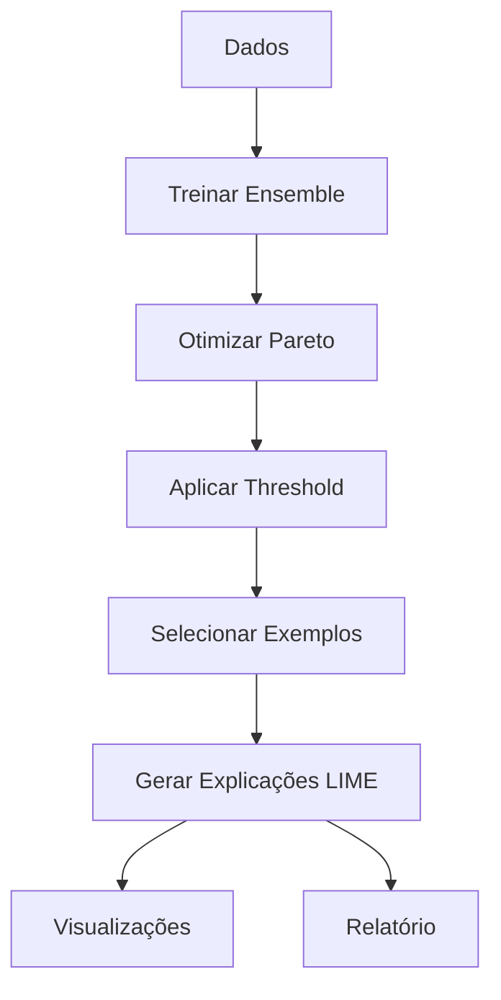

# Guia Rápido: Interpretabilidade com LIME

## 🎯 O que foi implementado?

Adaptamos o modelo ensemble para incluir **LIME** (Local Interpretable Model-agnostic Explanations), permitindo explicar **por que** cada contrato foi aceito ou rejeitado.

## 📦 Instalação

```bash
pip install lime
```

## 🚀 Como Executar

```bash
cd code/
python inadimplente_ENSEMBLE_PARETO_FINAL_LIME.py
```

## 📊 O que o código faz?

1. **Treina o Ensemble** (NN + LGBM + XGB → Meta-learner)
2. **Otimiza com Pareto** (Maximiza lucro, Minimiza inadimplência)
3. **Seleciona 6 exemplos diversos**:
   - Aceito adimplente (melhor caso)
   - Aceito adimplente (caso médio)
   - Aceito inadimplente lucrativo
   - Aceito inadimplente prejuízo (erro)
   - Rejeitado adimplente (erro)
   - Rejeitado inadimplente (acerto)
4. **Gera explicações LIME** mostrando top 10 features que influenciaram cada decisão

## 📁 Outputs

### `graficos/LIME_EXPLANATIONS/lime_top_examples.png`
Grid 3x2 com gráficos de barras:
- **Verde**: Feature aumenta lucro esperado
- **Vermelho**: Feature diminui lucro esperado

### `graficos/LIME_EXPLANATIONS/lime_report.txt`
Relatório detalhado para cada exemplo:
```
Exemplo: Aceito - Adimplente (maior lucro) (índice 1234)
Decisão do Modelo: ACEITAR
Lucro Predito: R$ 1,234.56
Lucro Real: R$ 1,200.00
Pagamento Real: 100.0%

Top 10 Features Mais Influentes:
 1. idade > 45                      | +0.2345 (AUMENTA lucro)
 2. score_SPC > 700                 | +0.1823 (AUMENTA lucro)
 3. num_parcelas <= 12              | +0.1456 (AUMENTA lucro)
 4. profissao_autonomo              | -0.0987 (DIMINUI lucro)
 ...
```

## 🔍 Como Interpretar

### Exemplo de Uso Prático

**Contrato #5678 foi REJEITADO**

```
Top features que levaram à rejeição:
1. score_SPC < 500        | -R$ 180 (peso: -0.18)
2. renda_mensal < 2000    | -R$ 120 (peso: -0.12)
3. num_parcelas > 36      | -R$ 95  (peso: -0.095)
→ Lucro esperado: -R$ 45 (abaixo do threshold)
```

**Justificativa para o cliente:**
> "Seu contrato foi rejeitado porque o score de crédito está baixo, a renda declarada é insuficiente para o valor solicitado, e o prazo muito longo aumenta o risco de inadimplência."

## 🎨 Personalizações

### Mudar número de exemplos

```python
# Linha ~390
num_samples=5000  # Mais samples = mais preciso, mas mais lento
```

### Mudar quantidade de features

```python
# Linha ~400
num_features=10  # Mostrar top 10 features (pode aumentar para 20)
```

### Adicionar mais categorias

```python
# Após linha ~420, adicionar:
mask_custom = aceitar_final & (X_test['idade'] > 60)
if mask_custom.sum() > 0:
    idx = np.where(mask_custom)[0][0]
    exemplos.append(('Aceito - Idoso', idx))
```

## ⚡ Performance

- **1 explicação**: ~1-2 segundos
- **6 explicações**: ~10-15 segundos
- **Todo o test set (9k)**: ~4-5 horas

## 📚 Documentação Completa

- `docs/LIME_IMPLEMENTATION.md`: Detalhes técnicos completos
- `docs/EMBEDDINGS_ANALYSIS.md`: Como os embeddings são analisados

## 🐛 Troubleshooting

### Erro: `ModuleNotFoundError: No module named 'lime'`
```bash
pip install lime
```

### Aviso: `LIME não disponível`
O código continua sem LIME. Instale a biblioteca para habilitar.

### Explicações muito instáveis
Aumente `num_samples` de 5000 para 10000 (mais lento, mais estável)

## 🔄 Workflow Completo



## 💡 Próximos Passos

1. **Dashboard Interativo**: Digite ID do contrato → veja explicação
2. **API REST**: Endpoint para explicar novos contratos em produção
3. **Comparação SHAP vs LIME**: Validar consistência
4. **Explicações em Batch**: Processar todos os contratos (pode demorar)

## 📞 Suporte

Para dúvidas sobre a implementação, consulte:
- `LIME_IMPLEMENTATION.md` para detalhes técnicos
- [Documentação oficial LIME](https://lime-ml.readthedocs.io/)
